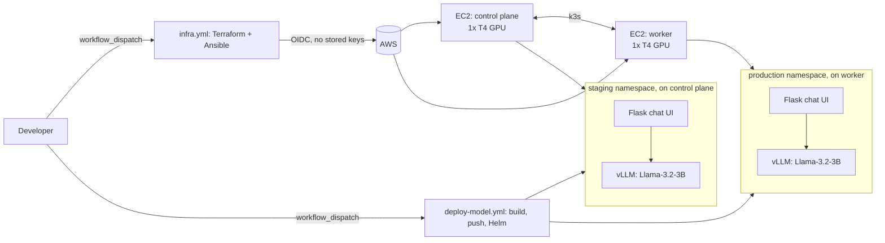
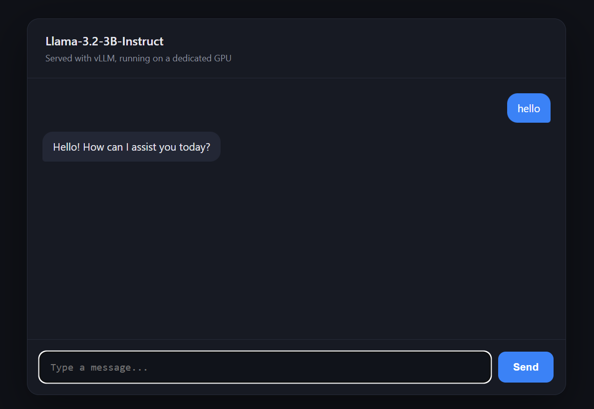
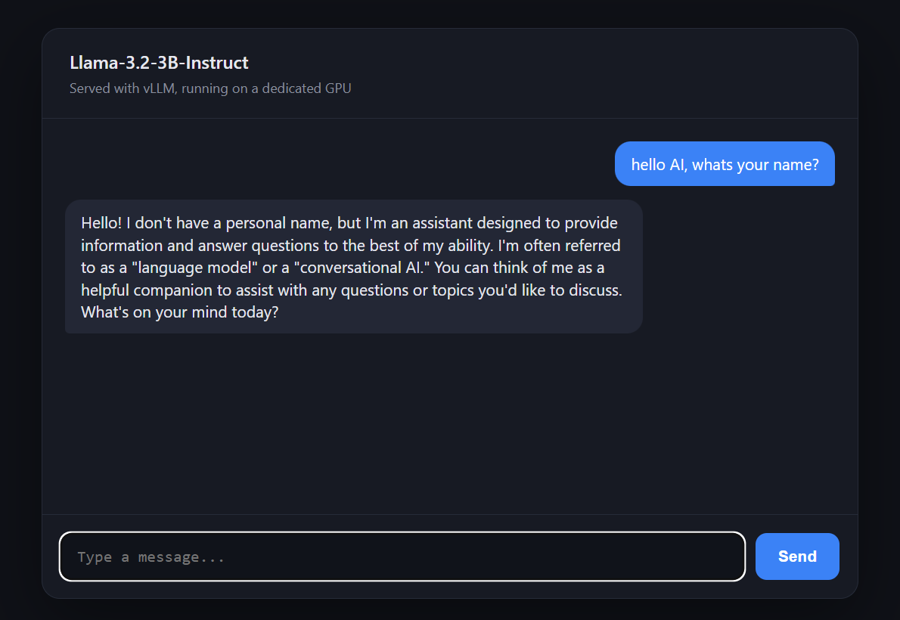

# v1: AI Model Service on GPU Kubernetes

## Goal

Bring up a GPU-backed Kubernetes cluster from scratch, serve Llama-3.2-3B-Instruct with vLLM, and put a simple chat UI in front of it, with staging and production each getting a dedicated GPU. No CI/CD pipeline yet: everything is applied, deployed, and tested by hand, the same way a real infrastructure change gets checked the first time a new kind of workload goes live, before any pipeline exists around it.

## Architecture

## Infrastructure

Two `g4dn.xlarge` EC2 instances (1 NVIDIA T4 GPU, 4 vCPUs each), provisioned with Terraform through a manually-triggered `infra.yml` GitHub Actions workflow. Authentication to AWS uses OIDC: a short-lived token is exchanged for temporary credentials on every run, and no AWS access key is ever stored in the repo.

The original design called for a single `g4dn.12xlarge` (4 GPUs on one instance), but the account's GPU vCPU quota capped out at 8, which a 48-vCPU instance can't fit into. Splitting into two smaller instances kept the core idea (a dedicated physical GPU per environment) while working within that limit, a realistic constraint any infrastructure engineer runs into with a new or lightly-used cloud account.

Each instance carries an IAM instance profile (created manually, the same way the GitHub Actions OIDC role is a one-time piece of identity rather than something Terraform creates and destroys every cycle) so the model service container can read and write cached weights in S3 without any credentials baked into the image.

## Kubernetes: a two-node k3s cluster

Ansible installs k3s on both nodes: the first as the server (control plane), the second as an agent that joins over the VPC's private network using a token read from the server. Each node is labeled at install time (`environment=staging` / `environment=production`), which Helm later uses to pin each environment's Pods to the right node with a `nodeSelector`.

The standard NVIDIA device plugin (not the GPU Operator) exposes each node's GPU to Kubernetes as an `nvidia.com/gpu` resource. With one GPU per node and no time-slicing, this is all that's needed: no shared-memory tuning, no metric-attribution complexity.

## Model service: vLLM + Llama-3.2-3B-Instruct

The model service is a Docker image built on a CUDA runtime base image, running vLLM's OpenAI-compatible server. `entrypoint.sh` checks for cached weights on local disk, then in an S3 bucket, and only falls back to downloading from Hugging Face (using a gated-model token) if neither has them, caching every fresh download back to S3 for the next run.

Getting vLLM actually running on a T4 took a few real fixes, worth noting since they weren't obvious from vLLM's own docs:

- `huggingface-cli download` has been deprecated in newer `huggingface_hub` releases in favor of `hf download`. Without pinning a version, this silently stopped working instead of erroring clearly.
- vLLM's `torch.compile` backend (Triton) compiles CUDA kernels at runtime, which needs a full C/C++ toolchain (`build-essential`) and the Python C headers (`python3-dev`), neither of which a plain CUDA *runtime* base image ships by default. A `gcc`-only fix wasn't enough; the missing piece was a full build environment.

## Chat UI

A small Flask app proxies chat requests to the model service over the cluster's internal DNS (never over the external NodePort), and renders a simple styled chat interface. Both the chat UI and the model service read a shared API key from a Kubernetes Secret created directly by the deploy workflow, never committed to git or written into a Helm values file.

## Deploying and testing

- **`infra.yml`** - apply/destroy the two-node cluster and the NVIDIA device plugin.
- **`deploy-model.yml`** - builds and pushes both images (tagged with the commit SHA), then deploys to one chosen environment via Helm.
- **`test/smoke-test.sh`** - run by hand after each deploy: checks both health endpoints, then sends a real prompt and confirms a non-empty completion comes back.

## Screenshots

**Staging** (`http://<control-plane-ip>:8001`)

**Production** (`http://<worker-ip>:8002`)

