# v2: CI/CD and GitOps for the Model Service

## Goal

In v1 every step was a button somebody pressed: trigger the deploy workflow, let Helm run from the runner, run the smoke test by hand. v2 turns that into a pipeline where Git is the source of truth. A merge to `main` builds and tests the images, a bot moves staging to the new tag, Argo CD applies it, an automated smoke test checks the live model, and production only moves when a person merges a promotion pull request that the smoke test result allows.

One constraint shapes the whole design: GitHub-hosted runners have no GPU, so CI can never run the model. What CI can check (tests, chart rendering, scripts) runs on every pull request. What only a GPU can answer (does the model actually respond?) runs against the real staging deployment after Argo CD syncs it, and that result decides whether a release can be promoted.

## Architecture

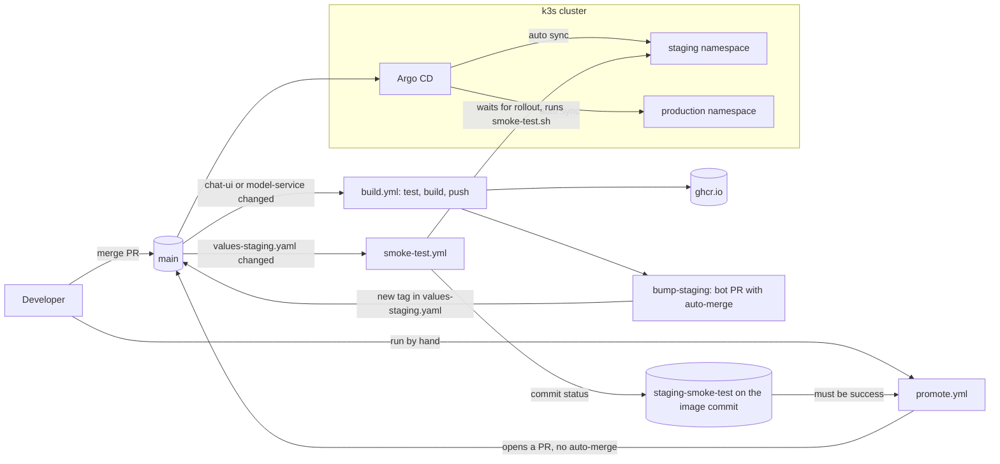

The path of one change, from the top:

1. A pull request runs `ci.yml`. Its three checks are required before anything can merge to `main`.
2. After the merge, `build.yml` runs, but only if `chat-ui/` or `model-service/` changed. It calls `ci.yml` again, builds both images, and pushes them to ghcr.io tagged with the commit SHA.
3. `bump-staging` opens a pull request that moves both image tags in `values-staging.yaml` to the new SHA. It has auto-merge enabled, so it merges as soon as the required checks pass.
4. Argo CD sees the change on `main` and syncs the staging namespace.
5. That same change to `values-staging.yaml` starts `smoke-test.yml`, which waits for staging to run the new tag, tests the live model, and records the result on the image's commit.
6. When staging looks good, `promote.yml` is run by hand. It copies staging's tags into `values-production.yaml` and opens a pull request, but only if the smoke test passed for that exact tag.
7. Merging the promotion pull request is the only human step in the release. Argo CD then syncs production.

## Configuration lives in Git

Argo CD only knows what is in Git, so everything that used to be passed with `--set` in the v1 deploy workflow moved into files. `values.yaml` holds the defaults both environments share. `values-staging.yaml` and `values-production.yaml` hold only what differs: the namespace, the two image tags, and the node ports.

The templates mark those values as `required`, and `values.yaml` deliberately has no default for them. A missing value fails at render time instead of quietly borrowing the other environment's number (a missing NodePort would otherwise become a random port that no security group rule matches). It also makes promotion trivial: it is a two-line change.

## CI: what can be checked without a GPU

`ci.yml` has three jobs, all of which run in seconds:

- **chat-ui:** seven tests run the Flask proxy against a fake model backend. They check the health endpoint and the page, that an empty request is rejected, that a request reaches the model with the API key and model name, and that an unreachable, slow, or rejecting model turns into a 502 for the user.
- **helm:** lints and renders the chart for both environments. It also renders it with no values file and expects that to fail, so nobody can reintroduce an environment-specific default.
- **scripts:** runs shellcheck on `entrypoint.sh`, `smoke-test.sh`, and `deploy-k3s.sh`.

## Argo CD

`infra.yml` now brings the whole GitOps layer up, right after the cluster itself: the two namespaces, the `hf-token` and `api-key` secrets (created here so their values never touch Git, and so pods can start the moment Argo CD deploys them), Argo CD v3.5.3, and the two Application manifests from `argocd/`. Argo CD is installed with server-side apply, because some of its CRDs are too large for client-side apply.

Because the cluster is destroyed after every session, this bootstrap matters. A fresh `apply` ends with both environments deployed from Git and no manual step in between.

Each Application points at `helm/ai-model-serving` on `main` with its own values file, and has automated sync with `prune` and `selfHeal` turned on. Production is automated too. The human decision is the promotion pull request, not a sync button. The repository is public, so Argo CD needs no credentials to read it.

## The smoke test as a gate

`smoke-test.yml` starts when the bot's pull request changes `values-staging.yaml`, and it can also be started by hand. It has two jobs:

- **check-infra:** looks for the `ai-model-serving-sg` security group, which exists only while Terraform's infrastructure does. If the infrastructure is down, an automatic run skips quietly (the cluster being off is normal) and a manual run fails with a clear message.
- **smoke-test:** opens the k3s API and the staging ports to the runner's IP only, waits until the `model-service` Deployment runs the new tag and finishes rolling out, runs `test/smoke-test.sh` against the live model, closes the access again (even if the test fails), and records a commit status named `staging-smoke-test` on the commit the image was built from.

Recording the result on the image's commit, rather than on the bump commit, means the result belongs to the exact code that was tested. `promote.yml` reads it from there.

## Promotion

`promote.yml` is manual and only runs from `main`. It compares the tags in the two values files:

- If they match, it says there is nothing to promote and stops.
- If they differ, it requires a passing `staging-smoke-test` on staging's tag. Without one, it fails and opens nothing.
- Otherwise it closes any older promotion pull request and opens a new one that moves production to staging's tag.

It never enables auto-merge. Production is merged by hand, and only then does Argo CD sync it.

## What was verified on a live cluster

- A fresh `apply` brought both environments up from Git with no manual step.
- A manual change on the cluster (scaling `chat-ui` from one replica to three) was undone by Argo CD within seconds.
- The full loop worked: a reworded UI subtitle went through build, bot pull request, staging sync, and smoke test, while production kept serving the old version until it was promoted.
- `promote.yml` refused a tag that had no smoke test result, and opened its pull request once one existed.
- After the cold start fix below, staging and production both rolled out with zero container restarts.

## Issues hit along the way

- **The bot could not push.** The first bump run failed with a 403 because the fine-grained token behind `ADMIN_PAT` only had access to secrets. It needs Contents, Pull requests, and Secrets write access. It has to be a personal token rather than the default `GITHUB_TOKEN`, since pull requests opened with the default token do not trigger other workflows, so the required checks would never run.
- **One merge produced two builds and two bump pull requests.** GitHub delivered the same push event twice. The second bump job checked out the merge commit instead of the latest `main`, so it saw a change that was already merged and opened a duplicate pull request. The fix: check out `main`, skip when the tag is already correct, and cancel duplicate runs for the same commit.
- **The model was killed while it was still starting.** On freshly created nodes, pulling the 5.6 GB image, syncing the weights from S3, and compiling kernels took longer than the startup probe's ten minutes (40 checks, 15 seconds apart). The kubelet restarted the container just before it became ready, and the weights, which live in the container's own filesystem, were lost, so the second attempt started from scratch. The startup probe now allows twenty minutes, and `progressDeadlineSeconds` is 1500. The second setting matters too: without it, Argo CD reports the app as Degraded and `kubectl rollout status` fails after ten minutes even when the pod is fine.
- **Terraform sat on the worker for over twenty minutes.** AWS never created the second instance, most likely a capacity problem for that instance type. Cancelling the run left a stale state lock in the S3 bucket and an orphaned Elastic IP, both of which had to be cleaned up by hand before the next apply. This is why the destroy step and a look at the EC2 console stay part of every session.

## Workflows and files

- **`infra.yml`:** apply or destroy the cluster, then create the namespaces and secrets and install Argo CD with its Applications.
- **`ci.yml`:** the three checks that run on every pull request and at the start of every build.
- **`build.yml`:** test, build and push both images, and open the staging bump pull request.
- **`smoke-test.yml`:** test the live staging model and record the result on the image's commit.
- **`promote.yml`:** open a production promotion pull request, gated on that result.
- **`argocd/`:** the two Application manifests.
- **`helm/ai-model-serving/`:** the chart, with a values file per environment.
- **`test/`:** the chat UI tests and `smoke-test.sh`.

`deploy-model.yml` from v1 is gone: builds moved to `build.yml`, secrets to `infra.yml`, and `helm upgrade` to Argo CD.

## Repository settings the automation depends on

- Auto-merge is allowed, and merged branches are deleted automatically.
- `main` requires a pull request and the three checks (`chat-ui`, `helm`, `scripts`). It does not require approvals, because the bot opens pull requests under the owner's account, which cannot approve its own work.
- The `ADMIN_PAT` secret holds the token described above.

## Screenshots

**Build workflow after a merge:** tests, image build and push, and the staging bump.
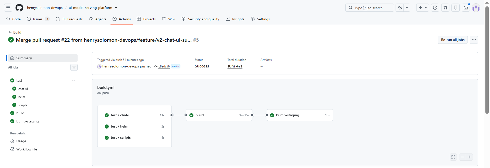

**Argo CD's view of staging:** the Deployments, ReplicaSets, Pods, and Services it manages from Git.
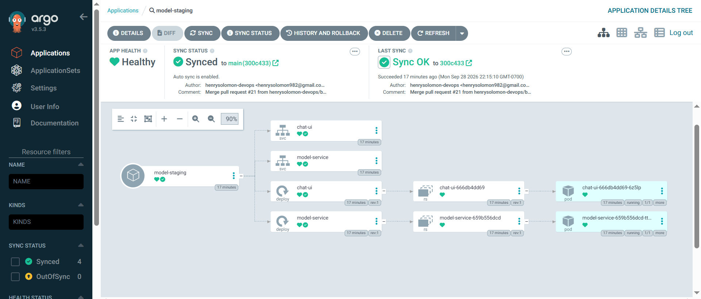

**A change reaches staging first.** Staging is syncing while production stays healthy on the old version.
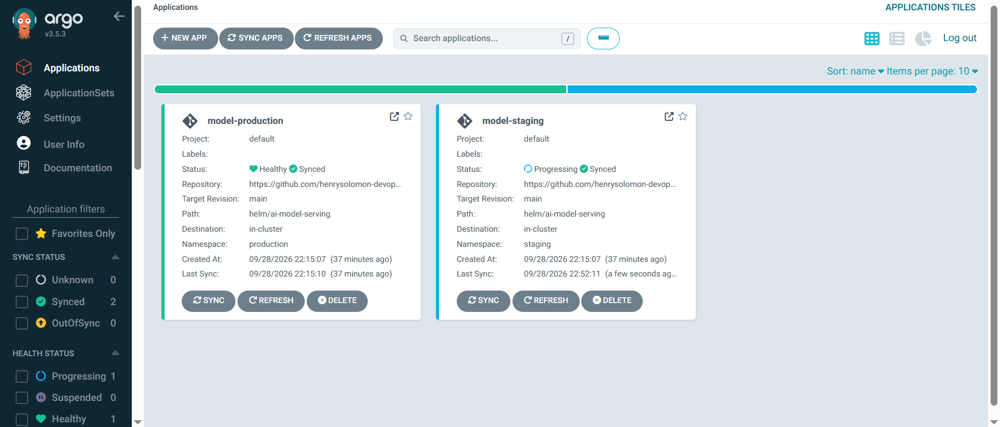

| Staging after the change | Production, still on the old version |
|---|---|
| 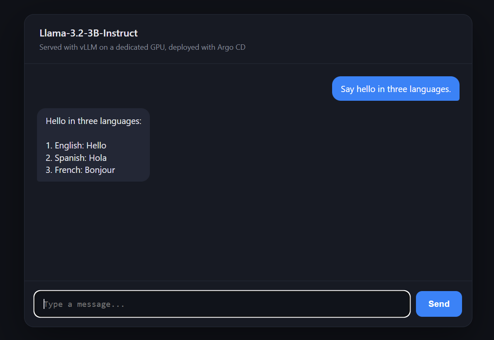 | 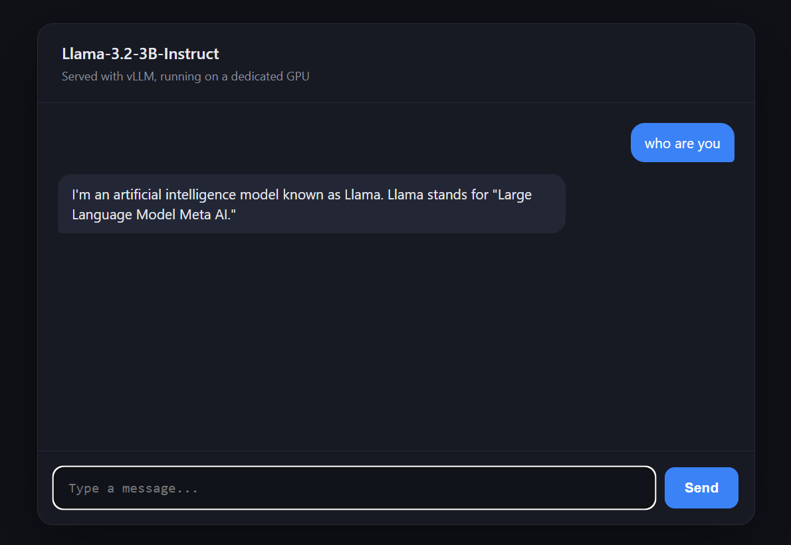 |

**The smoke test workflow:** an infrastructure check, then the test itself.
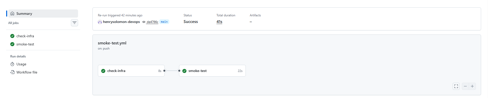

**A tag without a passing smoke test cannot be promoted.**
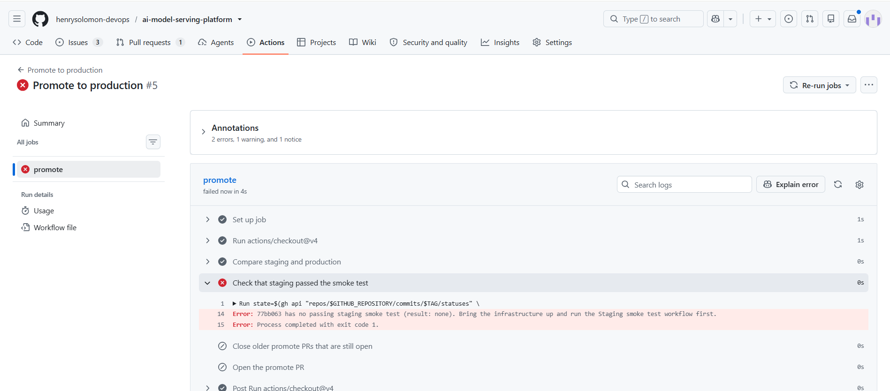

**Once the smoke test passes, promotion opens a pull request** that is merged by hand.
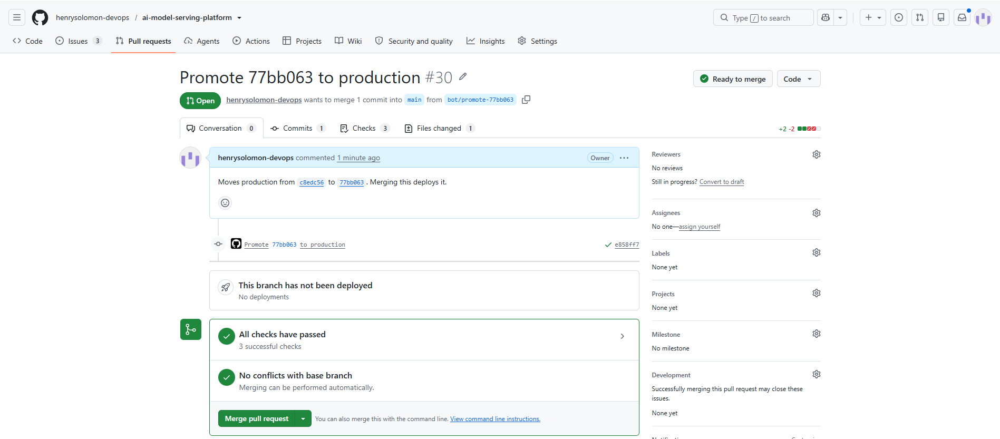

| Production after the promotion | Both environments in sync |
|---|---|
| 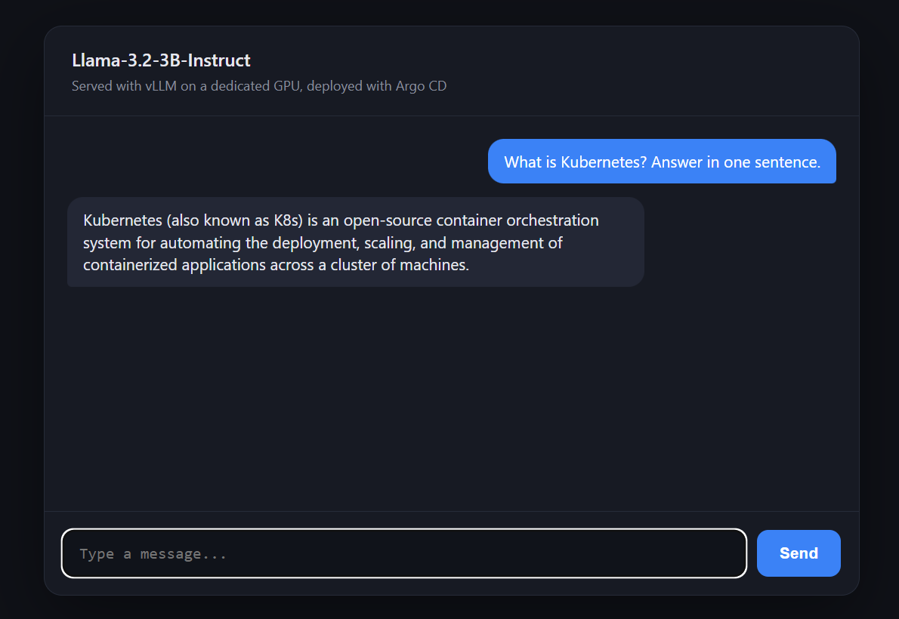 | 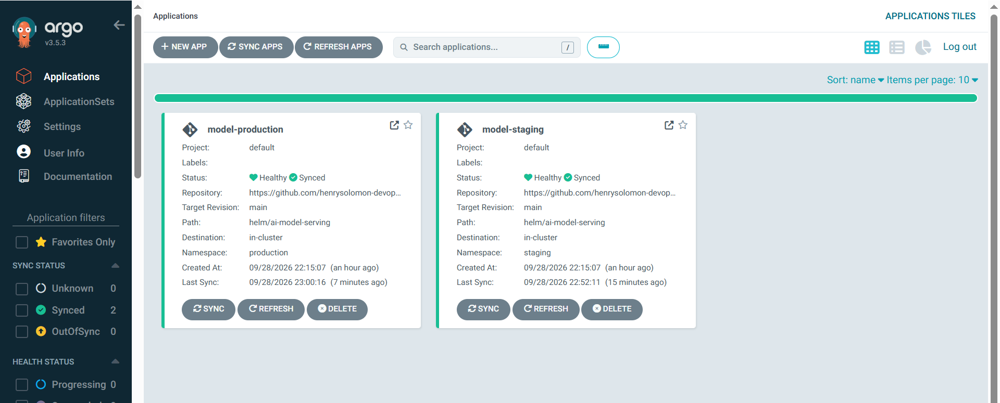 |
