# v3: GPU and model observability

v2 got the model onto a GitOps pipeline. v3 answers two questions: what are the GPU, the model and the chat UI doing right now, and will anyone hear about it if they stop?

The tools aren't new. The workload is what makes this interesting: besides CPU and requests, a model on a GPU has GPU memory, temperature and power, a KV cache that fills up, a queue inside the model server, and a cold start that takes minutes. This version makes all of that visible and ties each GPU to the environment that uses it.

Like the model, everything here is deployed by Argo CD from Git. Nothing was installed by hand.

## What this version adds

| Piece | What it does |
|---|---|
| DCGM Exporter | GPU utilization, memory, temperature and power, labeled with the pod and namespace using each GPU |
| kube-prometheus-stack | Prometheus, Alertmanager, Grafana, node and kube-state metrics |
| vLLM and chat UI metrics | request rate, latency, queue, KV cache, tokens, errors |
| Loki and Alloy | pod logs, stored in S3 |
| 12 alert rules | routed by a `team` label to two Slack channels |
| One Grafana dashboard | 18 panels in five rows, with a staging and production switch |
| A stricter smoke test | the promotion gate now also checks that the request showed up in Prometheus and the GPU is busy |

Pinned versions: kube-prometheus-stack 91.4.1, dcgm-exporter 4.8.4, loki 18.13.3, alloy 1.13.0, k3s v1.36.4+k3s1, and the AMI `Deep Learning Base OSS Nvidia Driver GPU AMI (Ubuntu 22.04) 20260929`.

## Architecture

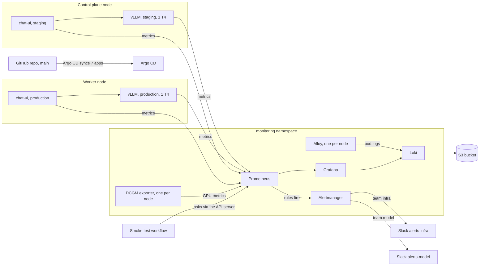

One monitoring stack serves the whole cluster. The GPUs are separate per environment, but whatever watches them doesn't need to be.

## Why these tools

| Need | Chosen | Why this one | Not used |
|---|---|---|---|
| GPU metrics | DCGM Exporter | NVIDIA's own exporter, and it knows which pod holds which GPU | The GPU Operator, which only pays off when GPUs are shared |
| Metrics and dashboards | kube-prometheus-stack | One chart gives Prometheus, Alertmanager, Grafana and the Operator, and ServiceMonitors let each app say how to be scraped | Hand-written scrape config, or a hosted service with its own account and bill |
| Logs | Loki with Alloy | Loki indexes only labels, so it's cheap, and it keeps its data in S3. Alloy is Grafana's current collector and is replacing Promtail | Elasticsearch, too heavy for two small nodes |
| Alerts | Alertmanager with Slack | Already in the stack, and it routes by label | A paging service, since there's no on-call rota |
| Dashboard | Grafana, provisioned from Git | A reviewed JSON file survives every destroy and apply | Building it by hand in the UI |

## How it fits together

### GPU metrics land in the right environment

DCGM Exporter runs on every node and doesn't ask for a GPU itself. It reads each GPU on its node and, because it runs in Kubernetes mode, adds the namespace and name of the pod using it.

One setting matters a lot: `honorLabels: true` on its ServiceMonitor. Without it Prometheus swaps `namespace` for the exporter's own, and the link to the model is gone.

Each environment owns a whole GPU on its own node (a v1 decision), so the result is easy to read: one series per GPU, labeled `staging` or `production`.

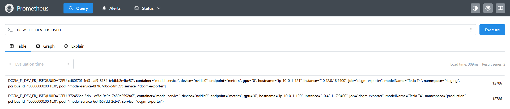

### Model and chat UI metrics

vLLM exposes Prometheus metrics natively. The chat UI got a small `/metrics` of its own (requests, duration, requests in flight, tokens). Two ServiceMonitors in a separate `monitoring-config` app tell Prometheus about both.

The targets page also caught a real problem right after the cluster came up: the production chat UI was `DOWN`. The chart on `main` asks for a non-root user, but production was still running the previous image, which runs as root, so Kubernetes refused to start it. The chart syncs the moment it's merged, while production only moves on a promotion. Promoting fixed it.

| Before the promotion | After the promotion |
|---|---|
| 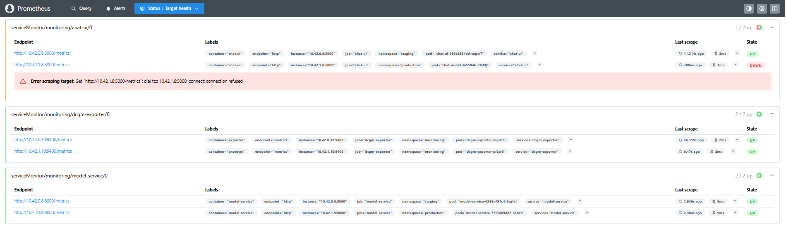 | 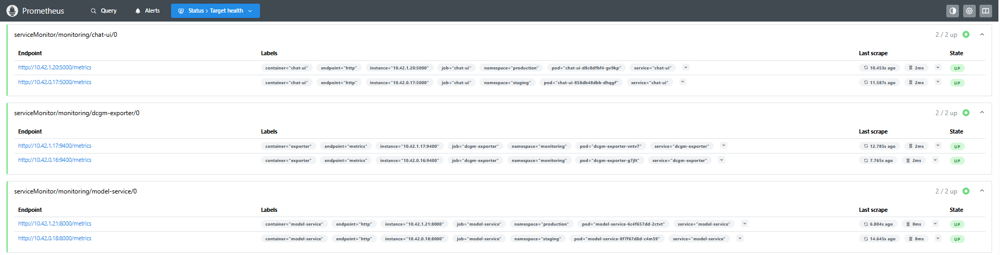 |

### Logs

Alloy runs on each node and reads only the pods on that node, so every line is ingested once, not once per node. Loki runs as a single binary and writes to an S3 bucket with a 14 day lifecycle.

Loki reaches S3 with the instance's IAM role. From inside a pod that only works if the EC2 metadata hop limit is 2 (the default of 1 blocks it), so the Terraform sets it on both instances. After the session the bucket held `index/` and `fake/` (the tenant name Loki uses when auth is off), so the writes worked.

### Alerts

There are 12 rules, and a `team` label decides which Slack channel gets the message. No label means nowhere, which is exactly what happens to the always-firing `Watchdog`.

| Team | Alert | Fires when | For |
|---|---|---|---|
| infra | NodeDiskPressure | the node reports disk pressure | 5m |
| infra | NodeMemoryPressure | the node reports memory pressure | 5m |
| infra | PodCrashLooping | more than 3 restarts in 15 minutes (staging, production, monitoring) | 5m |
| infra | PodNotReady | a pod is stuck in Failed or Unknown | 10m |
| model | ModelNotAvailable | no ready model replica | 25m |
| model | ModelMetricsMissing | the pod is ready but Prometheus has no scrape | 10m |
| model | GpuMetricsMissing | the pod is ready but no GPU series is linked to its namespace | 10m |
| model | ModelSlowResponses | p95 latency above 30 seconds | 10m |
| model | ModelRequestsQueueing | more than 5 requests waiting | 5m |
| model | ModelCacheNearlyFull | KV cache above 90 percent | 10m |
| model | GpuTooHot | GPU above 85 C | 5m |
| model | ChatUiErrors | more than 20 percent of chat requests fail with a 5xx | 5m |

`ModelNotAvailable` waits 25 minutes because a normal cold start can take 20, and an alert during a normal start only teaches people to ignore alerts. The two `Missing` alerts catch the quiet failure: the model works, the monitoring is broken, and nothing looks wrong.

Five of the rules, the trickiest ones, have unit tests that run in CI. The Slack webhook URLs are never in Git: `infra.yml` puts them in a Kubernetes Secret and Alertmanager reads them from a mounted file.

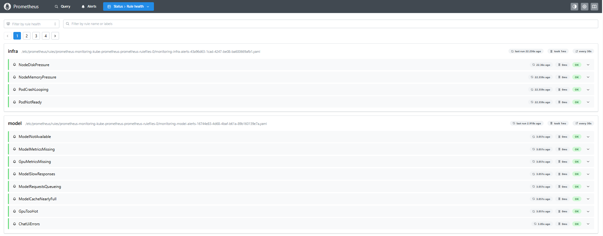

| alerts-infra | alerts-model |
|---|---|
| 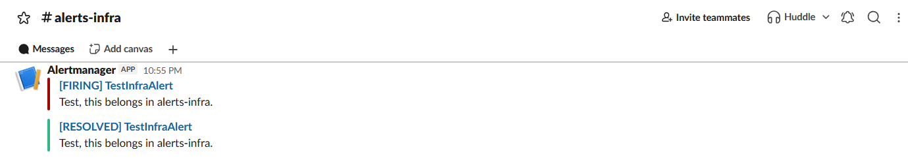 | 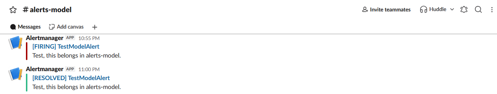 |

Alertmanager groups each alert under its receiver:

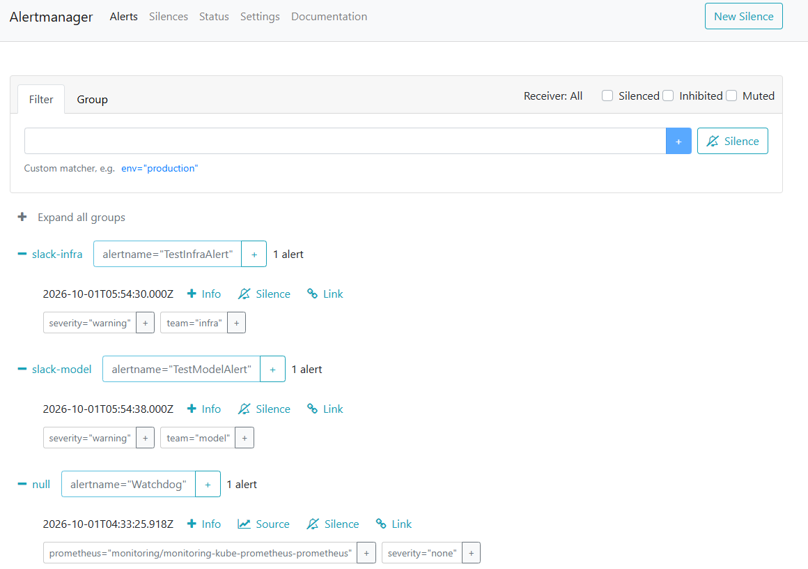

### The smoke test now checks metrics

The v2 smoke test sends a real prompt and checks that an answer comes back. In v3 the same prompt sits between two extra steps that ask Prometheus through the Kubernetes API server, so no extra port is opened:

1. Wait until Prometheus is scraping the staging model and note its request counter.
2. Send the prompt, which is the v2 test, unchanged.
3. Wait for the counter to go up, check that the staging GPU has more than 8000 MiB in use, and check that five metrics the dashboard and alerts rely on exist.

If the counter doesn't move, the request never reached the model or Prometheus can't see it. If GPU memory is low, the model isn't on the GPU or DCGM isn't linking it to staging. In both cases the commit gets no passing status and the promotion is refused.

This is an automatic run after a bot pull request moved staging to a new image. The whole job took 7 minutes 18 seconds, and 6 minutes 35 seconds of that was the first step waiting for the cold start. Everything else added up to under a minute. Earlier, before the cluster existed, the first run had skipped quietly. Re-running it once the cluster was up recorded the result that let the promotion through.

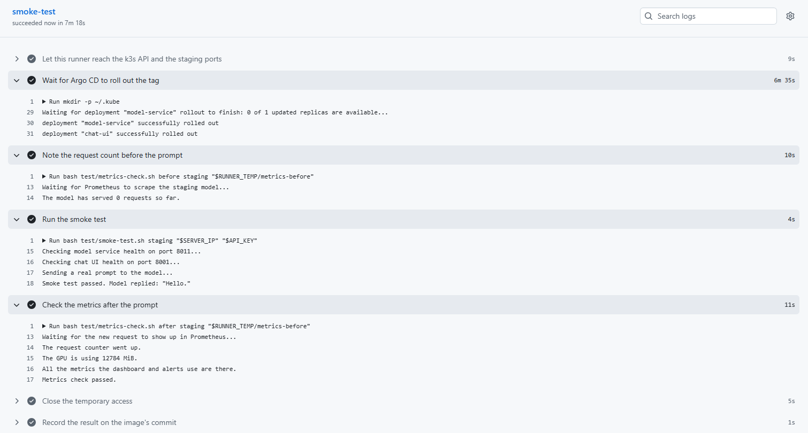

### The dashboard

One dashboard, 18 panels in five rows (Overview, Chat UI, Model, GPU, Logs), with an environment switch that moves every panel between staging and production. It's provisioned from a JSON file through a ConfigMap, so it's reviewed like code. The log panel hides health probes and scrapes, which leaves the engine's own lines and the chat requests.

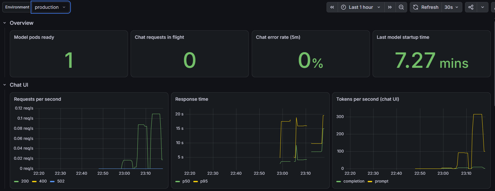

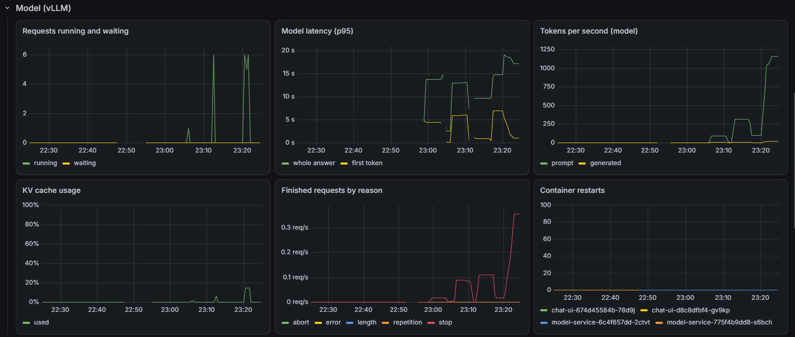

The GPU memory panel tells a small story: the drop to zero around 22:50 is the old model pod leaving and the new one loading.

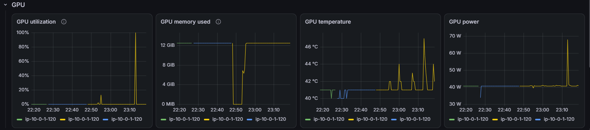

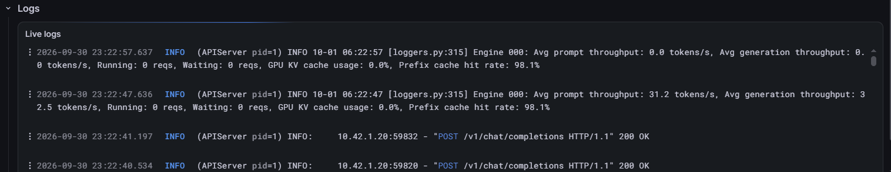

## What the session showed

### A real alert from real traffic

While I was generating traffic, the five minute error rate in staging reached 85 percent (56.8 percent in the screenshot, a few minutes later). The model server was answering the chat UI with `400 Bad Request`, and the chat UI turns any model failure into a 502.

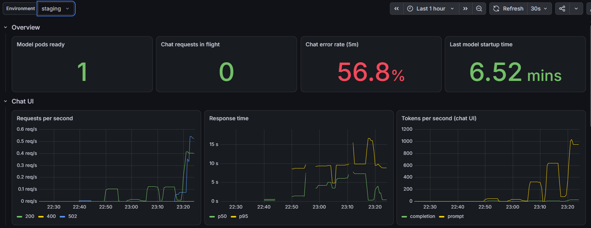

After five minutes of that, `ChatUiErrors` fired for real, landed in `#alerts-model`, and resolved by itself once the traffic stopped.

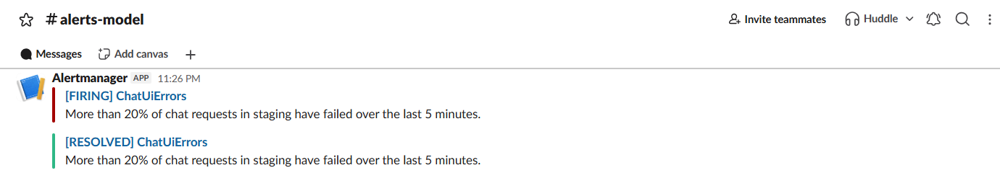

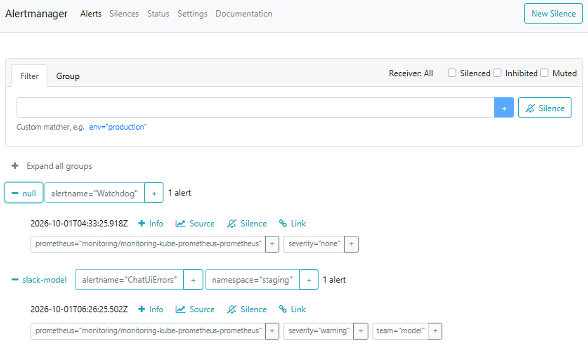

The vLLM access log only shows `400`, so I can't be sure why. The chat UI sends the whole conversation with every message, so a long chat can outgrow the 8192 token context, and that fits what I saw: after a short pause, the next message failed again because the page still held the full history. I didn't capture the error text, so it's a likely cause, not a proven one.

### Everything running

All seven Applications were synced and healthy, and the pod list shows where each piece ran, with staging on one node and production on the other.

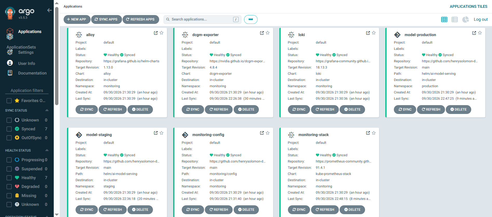

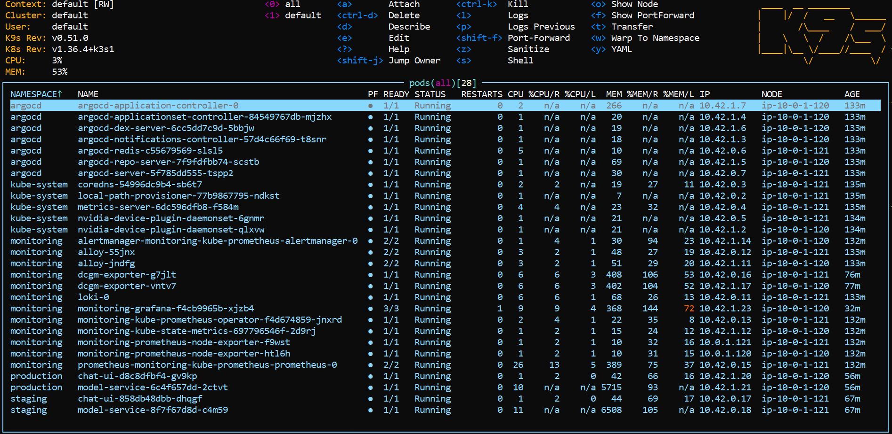

### Numbers

| What | Value |
|---|---|
| First cold start | 9 min 30 s: about 3.5 min pulling the image, 87 s syncing weights from S3, about 4.5 min loading the model and compiling kernels |
| Later cold starts, image already on the node | 6.5 min in staging, 7.3 min in production |
| GPU memory in use, per GPU | about 12.5 GiB of a 16 GB T4 |
| Cluster memory | 53 percent in k9s, 62 to 63 percent per node earlier in the session |

Peak memory per container over the two hour session:

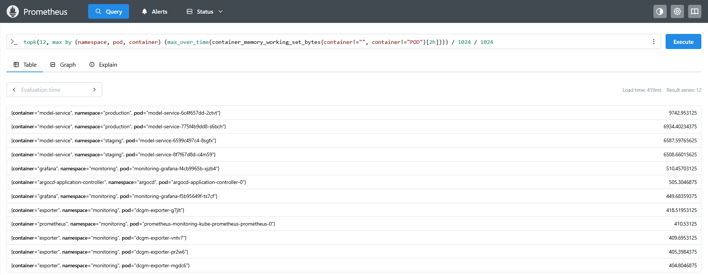

| Container | Peak | Limit or request |
|---|---|---|
| model (production, new pod) | 9.5 GiB | request 6Gi, no limit |
| model (the others) | 6.4 to 6.8 GiB | request 6Gi, no limit |
| Grafana | 510 MiB, then killed | limit 512Mi |
| Argo CD application controller | 505 MiB | none |
| DCGM exporter | 405 to 418 MiB | limit 768Mi |
| Prometheus | 411 MiB | limit 1Gi |
| everything else | under 404 MiB | |

## Problems found and fixed

- **Grafana ran out of memory twice.** The 256Mi limit came over from the first project and was too small for this dashboard. At 512Mi it was killed again under load (two tabs refreshing every 30 seconds, plus Explore). Its peak hit the limit, so the real peak is unknown, and the limit is still 512Mi.
- **DCGM's memory limit was too close.** The chart default is 512Mi and the exporter uses about 410, so the limit is now 768Mi.

## Trade-offs and limits

- **The model's memory request is below its startup peak.** The request is 6Gi, but one production cold start peaked at 9.5 GiB while the weights were written. Part of that is page cache the kernel can reclaim, but Kubernetes still counts it. It was fine on a 16 GB node.
- **Built for a short-lived cluster.** Prometheus has no persistent storage, there's no dead man's switch, and the hop limit of 2 lets any pod on a node use the instance role. Fine for a demo, not for a shared cluster.
- **The model pod has no security context.** Triton compiles kernels at runtime and the entrypoint writes to `/models`. The chat UI does run as non-root.

## What was not tested

- The failing path of the metrics gate. I only saw it pass.
- Most alerts. Of the 12, only `ChatUiErrors` fired for real, and two test alerts were sent by hand. The rest are covered by rule checks, and five by unit tests.
- A fresh `apply` with the pinned k3s version and AMI. Both were checked (the release and its files exist, and the AMI filter returns exactly one image), but no new apply has used them yet.

## Next

v4 replaces the plain Deployment with KServe in RawDeployment mode and adds a canary rollout. The canary decision will use the same metrics collected here.
