# v4: Production-style serving and a canary release

v3 made the model visible. v4 answers a different question: how does a new version of the model reach users without anyone holding their breath?

The tools aren't new. The workload is what makes this interesting. A model on a GPU takes up to 13 minutes to become ready on a cold node, holds a whole GPU while it waits, and can look fine from the outside while its queue or KV cache is filling up. So a new version can't just replace the old one. It has to run next to it, on its own GPU, take a small share of real traffic, and be compared with the stable model using the metrics from v3. Only then does a person decide whether it gets more.

Like everything before it, the serving layer and the release state are deployed by Argo CD from Git. Nothing was installed by hand.

## What this version adds

| Piece | What it does |
|---|---|
| KServe v0.21.0, Standard mode | Runs each model as an `InferenceService` on plain Kubernetes Deployments, with no Knative and no Istio |
| Envoy Gateway v1.9.2 | The gateway that model traffic goes through, using the Kubernetes Gateway API |
| cert-manager v1.21.2 | Issues the certificates KServe's webhooks need |
| A third GPU node | A card of its own for the canary, so the old and new model never share one |
| A weighted HTTPRoute | Splits production traffic between the stable model and the canary |
| `canary-step.yml` | Moves the canary to 10, 50 or 100 percent, checks it, and waits for approval |
| `canary_check.py` | The automated comparison of the canary and the stable model |
| `promote-production.yml`, `finish-release.yml` | Move production to the new image, then switch the canary off |
| `abort-release.yml` | The way out of a release nobody wants to continue |

KServe calls its plain Deployment mode Standard mode in recent releases. Older documentation, and the plan for this project, call it RawDeployment. It is the same thing.

## Architecture

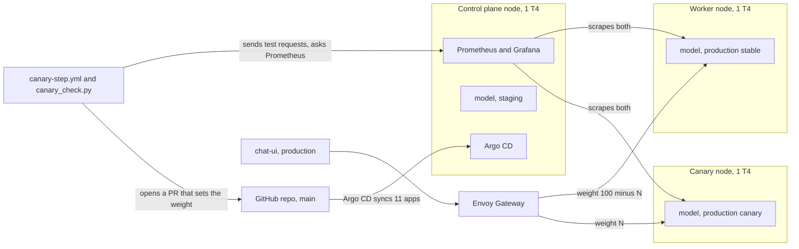

Production is now two InferenceServices, `model-service` and `model-service-canary`. They use the same chart and the same model, on different images and different nodes. The chat UI talks to one address, and a single HTTPRoute called `model-traffic` decides how many requests go to each.

## Why these tools

| Need | Chosen | Why this one | Not used |
|---|---|---|---|
| Model serving | KServe, Standard mode | The usual way to run models on Kubernetes. Each model becomes an `InferenceService`, and Standard mode keeps it as plain Deployments and Services | Knative and Istio, which are a lot of moving parts for a three node cluster |
| Gateway | Envoy Gateway | A small implementation of the Gateway API, and a weighted HTTPRoute is all the traffic splitting this needs | A service mesh |
| Certificates | cert-manager | KServe's webhooks need certificates, and this is the standard way to get them | Making them by hand |
| Traffic split | An HTTPRoute in this repo | The two models are separate InferenceServices on separate GPUs, so each keeps its own pods and its own metrics, which is what makes a clean comparison possible | KServe's built-in canary field. I tried it first and dropped it |
| Release control | GitHub Actions and a protected environment | Approval is a button on the run page, it is logged, and it needs no extra tool | A rollout controller, which would hide the decision logic this project is about |

## How it fits together

### Three GPUs, three jobs

Each node holds one T4. The control plane runs staging, the worker runs the stable production model, and a third node runs the canary. A canary on the same card as the stable model would share memory and compute with it, both would look slower, and the GPU metrics couldn't say which model caused what. With one card each, every number belongs to exactly one model. The price is a third `g4dn.xlarge`, which is small for a cluster that lives a few hours at a time.

### The traffic split

The chat UI sends requests to the gateway, and `model-traffic` splits them by weight between `model-service-predictor` and `model-service-canary-predictor`. KServe also creates a route of its own for each model, with a host name per InferenceService. The canary check uses those to talk to each model directly, which is how it compares them like for like while the weighted route is busy with the split.

### The release lives in Git

The state of a release is one file, `helm/ai-model-serving/values-production-canary.yaml`: whether the canary is on, which image it runs and what weight it gets. Only the canary workflows edit it, always through a pull request, and Argo CD applies it. A release is therefore reviewable in Git history like any other change.

Order is enforced with commit statuses on the image's commit: `canary-weight-10`, `canary-weight-50` and `canary-weight-100`. Step 50 needs 10 to be approved, step 100 needs 50, and going back to a lower weight after a higher one was approved is refused. Because the statuses sit on the image's commit and not on a run, an approval belongs to exactly the code that was checked.

### One release, step by step

1. **Build and staging.** Unchanged from v2 and v3. A merge builds the images, a bot moves staging to the new tag, Argo CD syncs it, and the smoke test records `staging-smoke-test` on the image's commit.
2. **Canary at 10 percent.** Run `Canary step` with weight 10. It has four jobs:
   - `plan` refuses to run unless staging passed its smoke test and the steps are in order.
   - `shift` starts the canary at weight 0, so its 10 to 15 minute warmup happens without any user traffic, then opens a pull request that sets the weight, waits for the route to show it, and runs the canary check.
   - `approve` waits for a person, through the `canary-approval` environment.
   - `record` writes the passing status on the image's commit.
3. **50 and 100 percent.** The same workflow, run again.
4. **Promote.** `Promote to production` opens a pull request that moves the stable model to the new image. Merging it by hand is the only way production changes.
5. **Finish.** `finish-release.yml` starts when that pull request merges. It waits until the stable model is ready on the new image and only then switches the canary off, so traffic never lands on a model that is still starting.

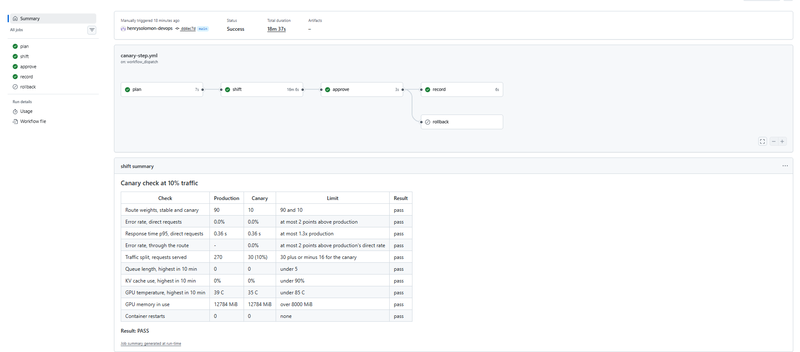

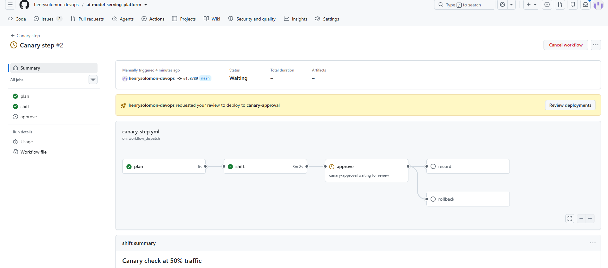

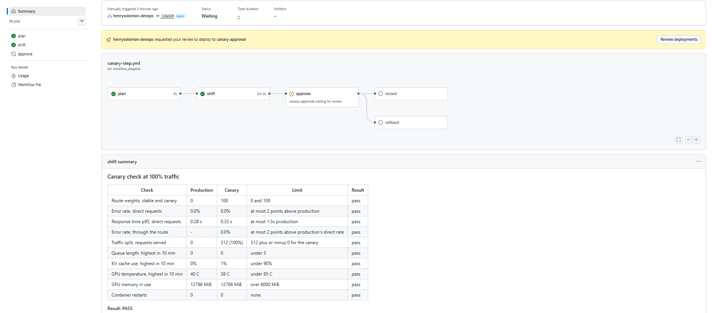

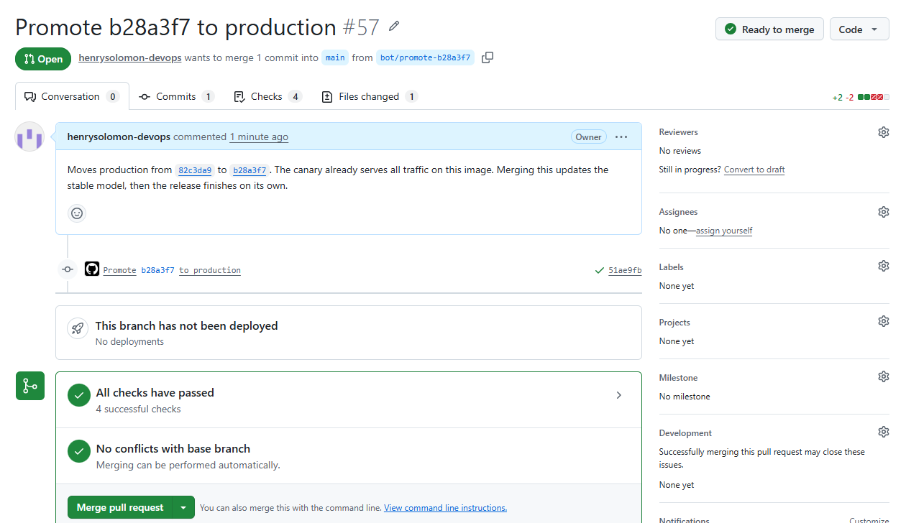

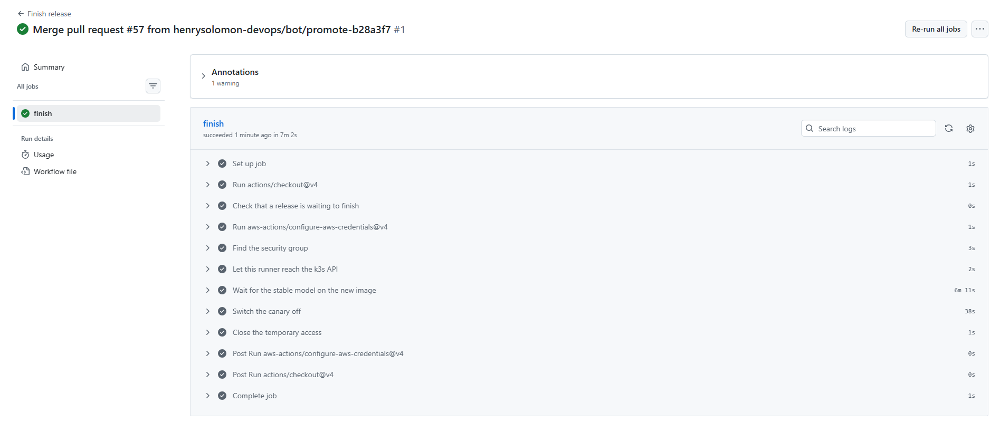

### The canary check

The check runs inside `shift`, once the route shows the new weight. It writes a table to the run summary and to the pull request. If any row fails, the job fails and the rollback runs.

| Check | Limit |
|---|---|
| Route weights, stable and canary | exactly what the step asked for |
| Error rate, direct requests | canary at most 2 points above stable |
| Response time p95, direct requests | at most 1.3 times stable, plus 0.3 s of slack |
| Error rate, through the route | at most 2 points above stable's direct rate |
| Traffic split, 300 requests through the route | within 3 standard deviations of the weight |
| Queue length, highest in 10 min | under 5 |
| KV cache use, highest in 10 min | under 90 percent |
| GPU temperature, highest in 10 min | under 85 C |
| GPU memory in use | over 8000 MiB, which proves the model is on the GPU |
| Container restarts | none |

Direct requests go to each model by its own host name, so the comparison is fair. Requests through the route use the real path the chat UI uses, and prove that the split matches the weight. Everything else comes from Prometheus, using the metrics v3 collects.

The limits are starting points. I only calibrated them on healthy runs, where canary and stable run the same image, so I know they stay quiet on a good canary but I haven't seen how they behave on a bad one.

### Rollback and abort

If the check fails or the reviewer rejects the approval, the `rollback` job sets the weight back to 0 and records the failure on the image's commit. If that run was the one that started the canary, it switches the canary off too, so it doesn't hold a GPU for nothing.

`Abort release` does the same thing on demand, for a release nobody wants to continue. It closes the open release pull requests, marks all three canary statuses as failed and switches the canary off. The image then has to start again from 10 percent.

## What the session showed

Everything ran on AWS: three `g4dn.xlarge` spot instances with Llama-3.2-3B-Instruct on vLLM.

### A full release

The first image went all the way through: 10, 50 and 100 percent, the promotion pull request, and `finish-release`, with no downtime and the canary removed at the end. The direct requests to each model by host name worked through the gateway, and the traffic split matched the weight in every check.

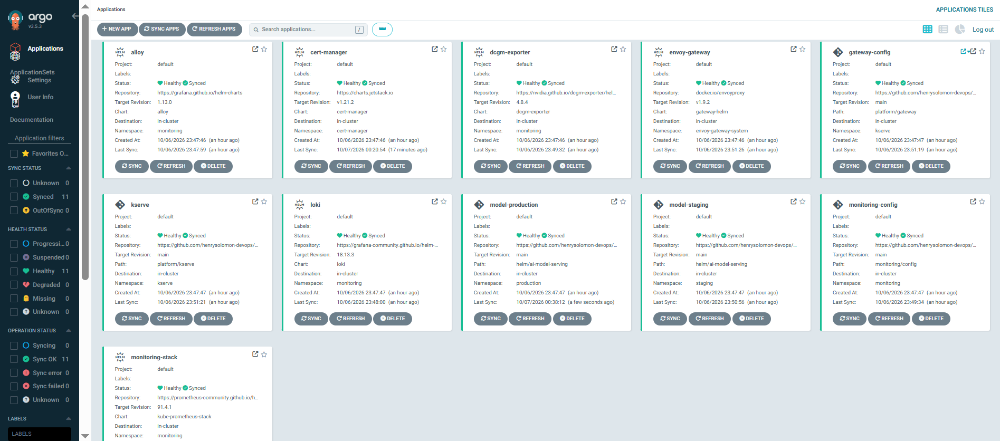

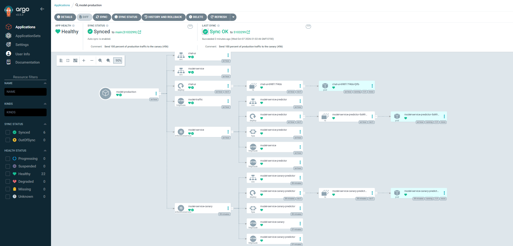

The Grafana dashboard from v3 shows both models side by side, each on its own GPU:

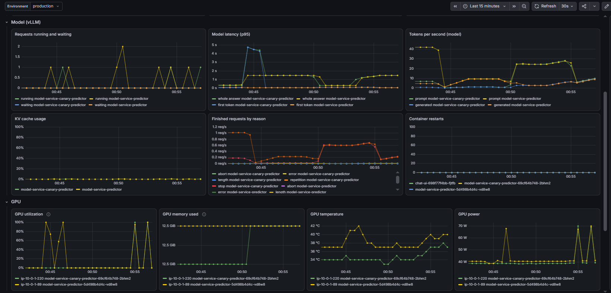

| Chat UI, staging | Chat UI, production |
|---|---|
| 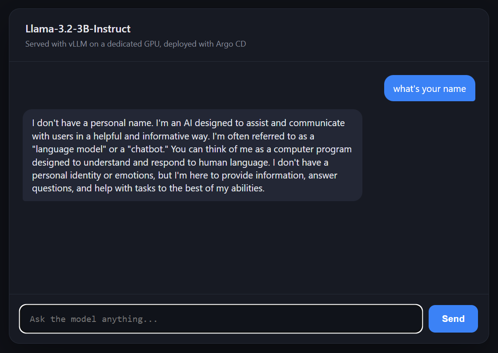 | 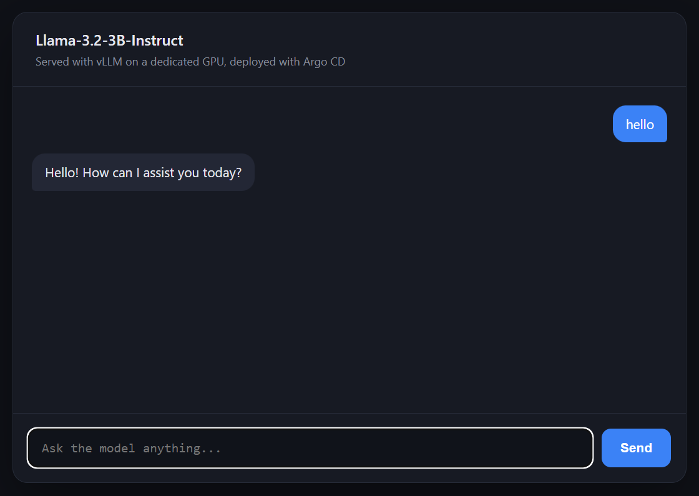 |

### Rollback and abort

I used a second image to test the ways out. I rejected the approval at 10 percent, and the rollback ran: the weight went back to 0, the canary was removed, and `canary-weight-10` was recorded as failed.

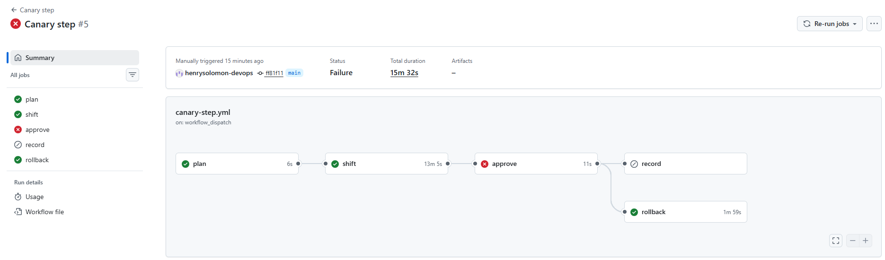

Then I ran the canary again, approved it, and ran `Abort release`. It finished in under two minutes, and afterwards the statuses on the image's commit were `staging-smoke-test` success and all three canary statuses failure, which is what a restart from 10 percent needs. The canary pod disappeared a few minutes later, once Argo CD had synced the change.

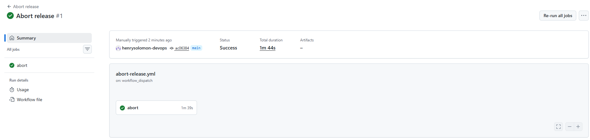

### Alerts that fired for real

The disk pressure problem below triggered real alerts, and they reached Slack without any help. `ChatUiErrors` is the one from v3.

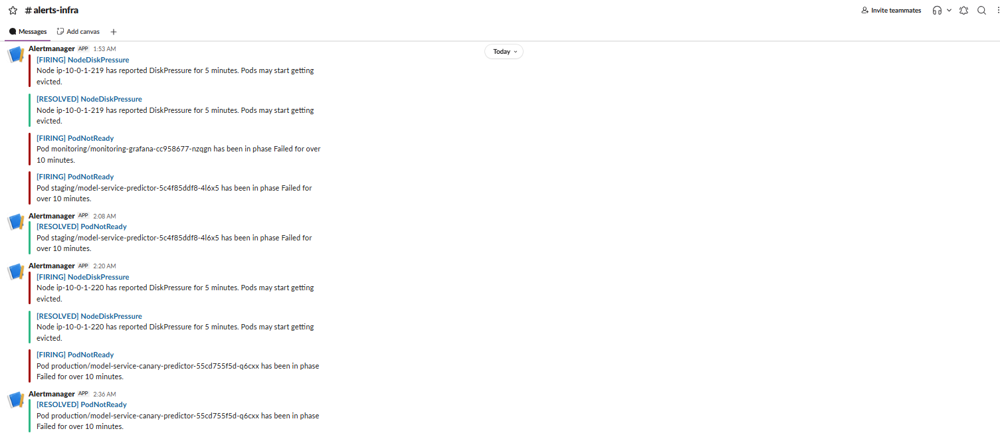

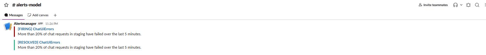

### Numbers

| What | Value |
|---|---|
| Model image | 5.6 GB, about 2 min to pull on a cold node |
| Weights loading | about 115 s |
| Kernel compile and warmup | about 1 min |
| First canary run, 10 percent | 18 min 37 s in total, 16 min 6 s of it in `shift` waiting for the cold canary |
| Later canary shifts | from 3 min (50 percent, canary already warm) to 13 min (cold node) |
| Build job | 10 min 50 s, or 12 min 35 s for the whole workflow |
| Staging pod on a fresh filesystem | 89 to 96 s in the entrypoint, checking the S3 cache |

The cold start dominates everything, which is why the canary starts at weight 0.

## Problems found and fixed

- **cert-manager's cainjector kept crashing.** It was killed for running out of memory at a 192Mi limit. It now has a 128Mi request and a 512Mi limit.
- **Argo CD shows Progressing during a cold start.** KServe has its own progress deadline of 10 minutes, and a cold model can take longer, so Argo CD can report Progressing or even Degraded while the pod is fine. I didn't fix this, only documented it.

### Disk pressure

This was the most useful accident of the session. Two nodes, the control plane running staging and the canary node, hit `DiskPressure`, and the kubelet evicted the model pods. The replacement pods stayed Pending until the taint cleared.

The cause is the AMI. The Deep Learning Base AMI ships four CUDA toolkits in `/usr/local` (12.8, 12.9, 13.0 and 13.2), about 41 GB together, and k3s data added another 31 GB. On a 100 GB volume that left the nodes at 81 to 84 GB used, and the kubelet starts evicting when about 4.8 GiB is free. The model pods don't request any ephemeral storage, so nothing in Kubernetes warned about it. The v3 alerts did, which is what they are for.

The fix is a bigger `volume_size` in `terraform/compute.tf`, or removing the toolkits the model doesn't use. I haven't made or tested that change, so the Terraform in this repo still uses 100 GB.

## Trade-offs and limits

- **One tag for both images.** The model and the chat UI share a single image tag, so a change to only the chat UI restarts the GPU model pod too, and with the Recreate strategy that means a cold start. Separate tags would fix it, and I left them out to keep the release logic simple.
- **CI has no GPU.** GitHub-hosted runners can only run contract and health tests. Anything that needs the model runs against the live cluster after the sync.
- **The thresholds are guesses.** A real team would tune them against a history of releases.
- **Some secrets are passed as arguments** (`--api-key`, `--token`). They are masked in the logs but would show up in the process list of a shared runner. These runners are single use.
- **Actions aren't pinned by SHA,** and the pull request token is a personal access token, not a GitHub App. Both would change in a real organization.
- **No `kubeconform` check** on the manifests yet. Helm lint and render run in CI.
- **GitHub warns about Node.js 20** on every run, because `actions/checkout@v4` still targets it. The runs work.
- **Built for a short life,** like v3. Prometheus has no persistent storage, and the cluster is destroyed after every session.

## What was not tested

- A canary that fails the automated check. Rollback was tested through a rejected approval, which runs the same job, but I never deployed a deliberately bad canary to watch the check fail.
- What the rollback job does when a whole run is cancelled from the UI.
- The bigger volume, because the change hasn't been made.

## Workflows and files

- **`canary-step.yml`:** move the canary to 10, 50 or 100 percent, check it, wait for approval.
- **`promote-production.yml`:** open the pull request that moves production to the canary's image.
- **`finish-release.yml`:** switch the canary off once the stable model runs the new image.
- **`abort-release.yml`:** stop a release and reset its statuses.
- **`scripts/`:** `canary-plan.sh`, `canary-state.sh`, `promote-plan.sh` and `finish-plan.sh`, the rules and state handling the workflows share.
- **`test/canary_check.py`:** the comparison between canary and stable.
- **`platform/`:** KServe, Envoy Gateway, cert-manager and the gateway config, deployed by Argo CD.
- **`helm/ai-model-serving/`:** the chart, which now renders InferenceServices and the HTTPRoute.

## Repository settings the release depends on

- The `canary-approval` environment has a required reviewer.
- The workflows that reach the cluster run in the `staging` environment and use the AWS role from v1.
- Bot pull requests merge on their own once the required checks pass, and production is merged by hand.
- `ADMIN_PAT` opens the release pull requests. Commit statuses are written with the job's own token.

## Next

This is the last version in the plan, and the plan is complete. The same model went through a hand-built cluster, a GitOps pipeline, observability and a canary release without a single change to the model. More versions may come later, but they would be new additions, not missing pieces. Guardrails, evaluation and quantization are real problems, but they are model problems, and they belong in another project.
